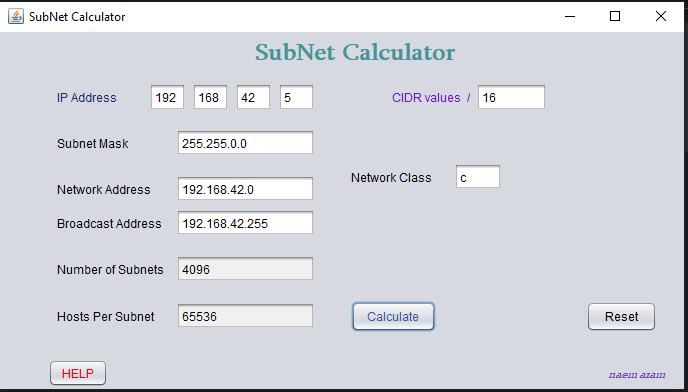
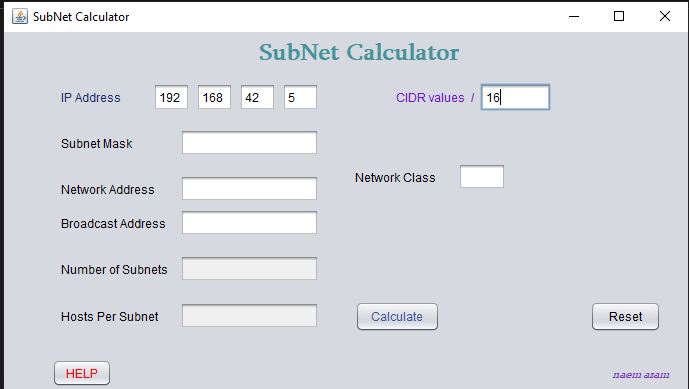
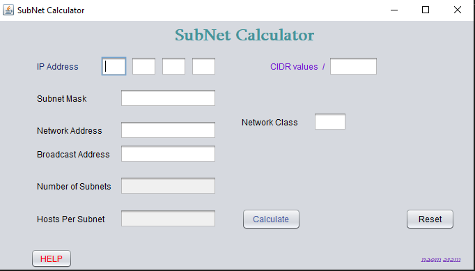

# Subnet calculator 

A subnetwork or subnet is a logical subdivision of an IP network. The practice of dividing a network into two or more networks is called subnetting. Computers that belong to the same subnet are addressed with an identical most-significant bit-group in their IP

[]()

## Installation For Windows OS

Use this software on Windows OS  [Download](https://pip.pypa.io/en/stable/) and Execute RAR file.


## Installing for Linux 

```bash
pip install foobar
```

## Usage

1. Provide [IP address](https://naemazam.github.io/post%20page/subnetpostpage.html) (ip4) and [CIDR](https://naemazam.github.io/post%20page/classfullvscidr.html) Value on the box. 


2. click press calculate 


3. click reset to clear all values. 




## Contributing
Pull requests are welcome. For major changes, please open an issue first to discuss what you would like to change.

Please make sure to update tests as appropriate.

## License
[MIT](https://choosealicense.com/licenses/mit/)
